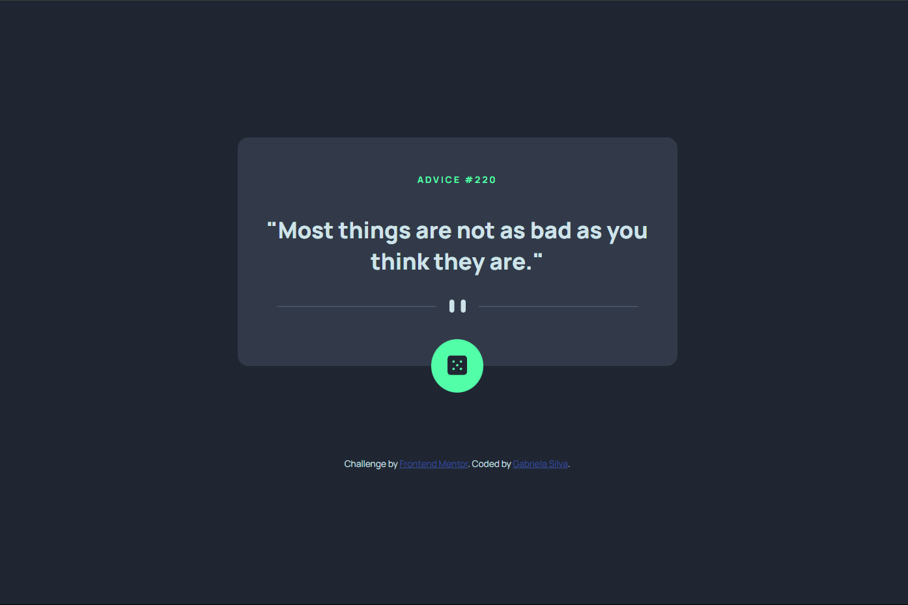

# Frontend Mentor - Advice generator app solution

This is a solution to the [Advice generator app challenge on Frontend Mentor](https://www.frontendmentor.io/challenges/advice-generator-app-QdUG-13db). Frontend Mentor challenges help you improve your coding skills by building realistic projects.

## Table of contents

- [Overview](#overview)
  - [The challenge](#the-challenge)
  - [Screenshot](#screenshot)
  - [Links](#links)
- [My process](#my-process)
  - [Built with](#built-with)
  - [What I learned](#what-i-learned)
  - [Continued development](#continued-development)
  - [Useful resources](#useful-resources)
- [Author](#author)

## Overview

### The challenge

Users should be able to:

- View the optimal layout for the app depending on their device's screen size
- See hover states for all interactive elements on the page
- Generate a new piece of advice by clicking the dice icon

### Screenshot



### Links

- Solution URL: [Add solution URL here](https://your-solution-url.com)
- Live Site URL: [Advice Generator](https://gabjen.github.io/advice-generator/)

## My process

### Built with

- Semantic HTML5 markup
- CSS custom properties
- Flexbox
- Mobile-first workflow

### What I learned

During this project, I was able to apply my basic knowledge of APIs, which I had acquired through online courses. I got a better understanding of how the `fetch()` command works - which is often used to search for URLs in the browser - and was able to use it in this project.

```javascript
fetch(url)
  .then(response => response.json())
  .then(json => displayResults(json))
  .catch(error => console.error(`Something went wrong:  ${error.message}`))
```

Using this command, I discovered one of its methods: `json()`. This method converts the results of the search made by `fetch()` into JSON format ([learn about JSON](https://www.w3schools.com/whatis/whatis_json.asp)), which makes it easier to manipulate the fetched data. This allowed me to include the search results in the HTML document.

```javascript
function displayResults(json) {
    slip = json.slip;
    advice.textContent = `"${slip.advice}"`;
    adviceId.textContent = slip.id;
}
```
### Continued development

- I want to improve my skills in developing responsive pages using pure CSS. Although I'm not completely comfortable with this subject, I've noticed an improvement in my performance. My code is becoming cleaner and I'm using the Mobile-first Workflow approach.

- I'm excited to improve my understanding of APIs, a subject that I'm not very familiar with. That's why I'd like to keep creating more projects that challenge me in this area. 

### Useful resources

- [Requesting data from the API - MDN](https://developer.mozilla.org/en-US/docs/Learn/JavaScript/Client-side_web_APIs/Third_party_APIs#requesting_data_from_the_api) - This section of the article was really helpful! It reminded me how to use the `fetch` command and provided a clear and concise explanation of the necessary steps. 

## Author

- GitHub - [GabJen](https://www.github.com/GabJen)
- Frontend Mentor - [@GabJen](https://www.frontendmentor.io/profile/GabJen)
- LinkedIn - [gabrielajenyffer](https://www.linkedin.com/in/gabrielajenyffer)
